  

  

  

---

### 🧑‍💻 About me

- 🎂 Born August 20, 1996
- 🗣️ Languages: English, Russian, Uzbek
- 💼 Run a team of developers at **Nahl**, delivering CRMs, websites, AI agents, and custom IT solutions
- 📬 Feel free to reach out for reliable IT services

### 🏢 Nahl — [nahl.uz](https://nahl.uz)

Custom software solutions: CRMs, websites, AI agents, and business automation. Have a project in mind? Let's talk.

  

### 🛠️ Tech I work with

  

### 📊 GitHub stats

  
  

### 🌐 Connect with me

  
  
  

